# TUI Inline Markdown Preview

**Date:** 2026-05-14
**Status:** Approved
**Branch:** `feat/tui-inline-markdown-preview`

## Problem

`chord inspect` opens a TUI with a left tree pane and a right Detail pane. The Detail pane currently shows only metadata (Name, Type, Scope, Status, Path, Plugin, child count). To see the underlying markdown content of a skill, command, or agent, the user must press `v` to open a fullscreen overlay. The fullscreen overlay renders plain markdown (literal `# heading`, `**bold**`, etc.) — no syntax styling.

This forces a mode switch for what is fundamentally a "glance at the contents" task and discards the at-a-glance value of seeing metadata and body together. The April 2026 TUI design document (`2026-04-26-claude-env-tui-design.md`) already showed an inline preview in its mockup but the implementation shipped without it.

## Solution

Show the markdown body inline in the Detail pane, below the metadata block, when the selected node points to a readable file. Render the markdown with lightweight styling (headings, bold, italic, inline code, code blocks, lists, links). Reuse the same styled renderer in the existing `v` fullscreen overlay so both surfaces look consistent.

A focus model lets the user keep tree navigation on `j`/`k` while opting into preview scrolling with `Tab`. When the selected node has no file (section header, plugin pseudo-path `plugin <id>`, hook, MCP server, or unreadable file), the inline preview is hidden and the metadata expands to fill the Detail pane — the existing experience for those rows is unchanged.

## Scope

**In scope:**
- New `src/tui/markdown.rs` module wrapping `pulldown-cmark` to convert markdown source into `Vec<ratatui::text::Line<'static>>`.
- Detail pane split: metadata top (auto-sized to content), styled markdown body below.
- Lazy load: read the file on every selection change for a previewable node. No cache.
- Adaptive split: when there is no previewable content, metadata fills the Detail pane (no empty bottom section).
- Focus model: `Focus::Tree` (default) vs `Focus::Preview`. `Tab` toggles, `Esc` from Preview returns to Tree.
- Apply the same styled renderer to the fullscreen `v` overlay.
- Border-color focus indicator on both Tree and Detail blocks.
- Updated keybind hint line that reflects current focus.

**Out of scope:**
- Caching read files across selections (Q1 ruled lazy-per-selection).
- Markdown features beyond: headings H1-H6, `**bold**`, `*italic*`, `` `inline code` ``, fenced code blocks, ordered and unordered lists, links. (Tables, blockquotes, images, footnotes, task lists, HTML pass-through deferred.)
- Editing markdown in the TUI.
- Search inside the preview body.
- Phase 2 features from the April 2026 spec (install missing, scope switch, remove tool).

## User Stories

1. As a user browsing my Claude environment, I select a skill in the tree and immediately see its markdown content rendered next to its metadata, without pressing any extra key.
2. As a user reading a long preview, I press `Tab` to focus the preview pane, then `j`/`k` to scroll line by line and `PageDown`/`PageUp` to page through. I press `Esc` to return focus to the tree and resume navigating.
3. As a user, when I select a row that has no file (a plugin row, a section header, a hook entry, an MCP server), the Detail pane shows only metadata; nothing about the preview surface is visible.
4. As a user, when I press `v` on a skill, the fullscreen overlay uses the same styled rendering as the inline preview — no inconsistency between the two views.
5. As a user, if a file referenced by a node cannot be read (permission denied, deleted between scan and view), a status-bar message tells me why; the preview is silently hidden, focus stays on the tree.

## Architecture

### New module: `src/tui/markdown.rs`

Pure function:

```rust
pub fn render(source: &str) -> Vec<ratatui::text::Line<'static>>
```

Uses `pulldown-cmark` event iteration. Maps inline events to `Span`s with styles; emits a `Line` at each soft/hard break or block boundary. Lines are owned (`'static`) so they can be stored in the app and rendered by `Paragraph` with `Wrap { trim: false }`.

Style mapping (initial):

| Element | Style |
|---|---|
| H1 | `Cyan + BOLD`, prefix `# ` stripped |
| H2 | `Magenta + BOLD` |
| H3 | `Yellow + BOLD` |
| H4-H6 | `White + BOLD` |
| `**bold**` | `BOLD` modifier |
| `*italic*` | `ITALIC` modifier |
| `` `code` `` | `Yellow` |
| fenced code block | `DarkGray` background-equivalent (`fg=Gray`), each line prefixed `│ ` |
| unordered list item | `• ` prefix |
| ordered list item | `N. ` prefix |
| link | `Cyan + UNDERLINED`, rendered as `text (url)` |
| paragraph | default |
| blank line | empty `Line` |

Tables, blockquotes, HTML pass-through: drop content silently in this phase.

### App state changes (`src/tui/app.rs`)

```rust
#[derive(Debug, PartialEq, Clone, Copy)]
pub enum Focus {
    Tree,
    Preview,
}

pub struct App {
    // ...existing fields...
    pub focus: Focus,                       // new, default Tree
    pub home_dir: Option<std::path::PathBuf>, // new, used by update_preview to expand `~/`
}
```

`App::new` signature changes to `pub fn new(tree: Vec<TreeNode>, home_dir: Option<PathBuf>) -> Self`. Callers (`src/main.rs` TUI entry point) pass `dirs::home_dir()` once at startup.

New method:

```rust
fn update_preview(&mut self)
```

Called from `App::new` (after `rebuild_flat`), `move_up`, `move_down`, `toggle_expand`, `expand`, `collapse`, `toggle_enabled_filter`, `apply_search_filter`, and after `execute_toggle` in `handler.rs`.

Logic:
1. Look up `selected_node()`. If None: clear `markdown_content`, reset scroll, force `focus = Tree`, return.
2. Extract `path`. If None or `starts_with("plugin ")`: same as step 1.
3. Expand `~/` using `self.home_dir`. The expansion helper currently inlined in `handler.rs::handle_normal` for the `v` key is extracted to a small private function (`expand_tilde(path: &str, home: Option<&Path>) -> String`) and shared by both call sites.
4. `std::fs::read_to_string(expanded)`:
   - `Ok(content)`: `markdown_content = Some(content)`; `markdown_scroll = 0`.
   - `Err(e)`: clear `markdown_content`, reset scroll, force `focus = Tree`, set status `"Preview unavailable: {e}"`.

`update_preview` is **idempotent** and **cheap** in the common case (one filesystem stat + read of a small markdown file).

### Handler changes (`src/tui/handler.rs`)

`handle_normal` routes keys by `app.focus`:

| Key | `Focus::Tree` | `Focus::Preview` |
|---|---|---|
| `j` / Down | `move_down` | `markdown_scroll += 1` |
| `k` / Up | `move_up` | `markdown_scroll -= 1` (saturating) |
| `h` / Left | `collapse` | no-op |
| `l` / Right | `expand` | no-op |
| `PageDown` | no-op (today) | `markdown_scroll += 20` |
| `PageUp` | no-op (today) | `markdown_scroll -= 20` (saturating) |
| Enter | `toggle_expand` | no-op |
| `Tab` | if `markdown_content.is_some()` → `Focus::Preview`; else status `"No preview"` | `Focus::Tree` |
| `Esc` | quit | `Focus::Tree` |
| `q` | quit | quit |
| Ctrl-C | quit | quit |
| `e`, `i`, `v`, `/` | as today | as today (focus-agnostic) |

`v` overlay trigger keeps the existing path-expansion + `read_to_string` block. (Could be deduplicated with `update_preview` later; this spec keeps it as-is to bound the diff.)

### UI changes (`src/tui/ui.rs`)

`render_detail` revised:

```text
1. Build metadata `Vec<Line>` exactly as today minus the keybind hint line.
2. Build the keybind hint line based on (markdown_content present, focus). Append as the last entry of metadata.
3. If app.markdown_content.is_none():
     - Render single Paragraph in inner area (current behavior — metadata + hint fill the Detail block).
4. Else:
     - meta_height = metadata.len() as u16 + 1  // +1 for spacer line between metadata and preview
     - Split inner vertically: Length(meta_height) | Min(0)
     - Render metadata Paragraph in top region.
     - Render preview Block + Paragraph in bottom region:
         block borders = TOP only (a single horizontal separator above the preview body)
         block title = " Preview "
         block border style = Cyan when focus == Preview, DarkGray otherwise
         body = markdown::render(content), scroll = (markdown_scroll, 0), Wrap { trim: false }
```

Block borders carry the focus indicator:

- Tree block border: `Cyan` when `focus == Tree`, `DarkGray` otherwise.
- Inner preview block border (the top-edge separator): `Cyan` when `focus == Preview`, `DarkGray` otherwise.
- The outer Detail block border stays its current cyan-titled style regardless of focus.

Keybind hint line (last line of the metadata Paragraph in both layouts):

- `focus = Tree`, no preview: `[e] toggle  [v] view  [i] {all|enabled}  [/] search  [q] quit` (unchanged from today).
- `focus = Tree`, preview present: `[Tab] preview  [e] toggle  [v] full  [i] {all|enabled}  [/] search  [q] quit`.
- `focus = Preview`: `[Tab/Esc] back  [j/k] scroll  [PgUp/PgDn] page  [v] fullscreen  [q] quit`.

`render_markdown_overlay` (fullscreen `v` view):

- Replace `Paragraph::new(content)` with `Paragraph::new(markdown::render(content))`.
- Same close keys, same scroll behavior.

`render_tree`, `render_status`, `render_confirm_disable_popup`: untouched apart from passing the focus-derived border style into `render_tree`'s block.

### Dependency

Add to `Cargo.toml`:

```toml
pulldown-cmark = { version = "0.12", default-features = false }
```

`default-features = false` drops `getopts` and CLI helpers — we only need the library API.

## Data Flow

```dot
digraph data_flow {
  rankdir=LR;
  "key event" -> "handler::handle_key";
  "handler::handle_key" -> "App mutator\n(move_up/down/expand/...)";
  "App mutator\n(move_up/down/expand/...)" -> "update_preview";
  "update_preview" -> "fs::read_to_string" [label="if previewable"];
  "fs::read_to_string" -> "markdown_content = Some(s)";
  "fs::read_to_string" -> "markdown_content = None\nfocus = Tree\nstatus = err" [label="Err"];
  "update_preview" -> "markdown_content = None\nfocus = Tree" [label="no path or plugin sentinel"];
  "markdown_content = Some(s)" -> "render_detail";
  "markdown_content = None\nfocus = Tree" -> "render_detail";
  "render_detail" -> "markdown::render" [label="if Some"];
  "markdown::render" -> "Paragraph(lines)";
}
```



## Error Handling

| Condition | Behavior |
|---|---|
| Node has no `path` (section headers, hooks routed via `from_plugin` without a file path) | `markdown_content = None`; preview surface hidden; no status message. |
| Path starts with `plugin ` (plugin pseudo-path sentinel) | Same as above. |
| `read_to_string` fails (ENOENT, permission denied, non-UTF-8) | `markdown_content = None`; status bar shows `"Preview unavailable: {error}"` for 3 s; focus forced to `Tree`. |
| File read succeeds but is empty | `markdown_content = Some("")`; `markdown::render("")` returns empty `Vec`; preview pane shows blank under its border. Acceptable — distinguishes "exists but empty" from "doesn't exist". |
| `pulldown-cmark` encounters malformed UTF-8 | Cannot — `read_to_string` already rejects non-UTF-8 with `Err`. |
| Very large file (e.g., a 1 MB skill) | Whole content held in `markdown_content` and rendered. No file-size cap in this phase; revisit if a user reports lag. |
| Selection moves from previewable → non-previewable while focus is `Preview` | `update_preview` resets `focus` to `Tree`. The user does not get stuck. |

No `unwrap`/`expect` on file I/O. All branches return `Result`-style: success populates state, failure clears and signals.

## Testing

### New: `src/tui/markdown.rs` unit tests

Co-located in the module under `#[cfg(test)]`. Assert on the `spans` vector of each `Line`:

- `render_empty_returns_empty_vec`
- `render_plain_paragraph_preserves_text`
- `render_h1_through_h6_apply_expected_color_and_bold`
- `render_bold_span_has_bold_modifier`
- `render_italic_span_has_italic_modifier`
- `render_inline_code_is_yellow`
- `render_fenced_code_block_emits_one_line_per_source_line`
- `render_unordered_list_item_starts_with_bullet`
- `render_ordered_list_item_starts_with_number`
- `render_link_emits_underlined_cyan_text_with_url_suffix`
- `render_does_not_panic_on_table_or_html` — these are dropped silently; no crash.

### Extended: `src/tui/app.rs` tests

Use `tempfile::NamedTempFile` for any test that needs a real file:

- `update_preview_clears_for_section_header`
- `update_preview_clears_for_plugin_pseudo_path`
- `update_preview_clears_when_node_has_no_path`
- `update_preview_loads_existing_file` — writes `# Hi\n` to a tempfile, builds a tree with one leaf pointing to it, asserts `markdown_content == Some("# Hi\n")`.
- `update_preview_clears_and_resets_focus_on_read_error` — point at a path that does not exist; asserts `markdown_content.is_none()` and `focus == Focus::Tree`.
- `update_preview_called_after_move_up_and_move_down`
- `update_preview_called_after_filter_toggle`

### Extended: `src/tui/handler.rs` tests

- `tab_with_preview_switches_focus_to_preview`
- `tab_without_preview_is_noop_and_sets_status`
- `j_in_preview_focus_scrolls_markdown`
- `k_in_preview_focus_scrolls_markdown_saturating_at_zero`
- `pagedown_in_preview_focus_pages`
- `esc_in_preview_returns_focus_to_tree`
- `esc_in_tree_quits`
- `e_works_in_preview_focus_too` — focus-agnostic keys remain active.

### Manual smoke test (post-merge checklist)

1. `cargo run -- inspect`.
2. Navigate to a plugin → Skills → pick a skill. Preview appears below metadata, styled.
3. Press `Tab`. Detail border turns cyan, tree border dims. Status hint updates.
4. Press `j` repeatedly — preview scrolls, tree selection does not move.
5. Press `Esc`. Focus returns to tree.
6. Navigate to a plugin row (path = `plugin <id>`). Preview disappears, metadata expands.
7. Press `v` on a skill. Fullscreen overlay shows styled markdown.
8. Delete the underlying file mid-session (`rm ~/.claude/plugins/cache/...`), move selection off and back: status shows `"Preview unavailable: ..."`, preview hidden.

### Not in test scope

E2E Docker suite does not exercise the TUI (existing constraint — `e2e/run.sh` walks samples via the CLI). No new e2e wiring.

## Code Quality

- `cargo fmt` and `cargo clippy -- -D warnings` must pass before merge.
- `cargo test` runs the full unit suite (new tests included).
- New module follows existing TUI conventions: no `unwrap` on user-reachable paths, all I/O errors surface as status messages, public API documented with `///`.
- `pulldown-cmark` is the only new dependency. License: MIT.

## Rollout

Single PR on `feat/tui-inline-markdown-preview`. No migration, no config change, no command-line flag needed — the inline preview is purely additive UI. Existing `v` overlay behavior is preserved (now with styling).

## Open Questions (resolved)

- Layout: split Detail vertically, metadata top + markdown body bottom.
- Loading strategy: lazy on selection, no cache.
- Renderer: styled via `pulldown-cmark`, same renderer in overlay.
- Missing-file behavior: hide split, metadata fills Detail.
- Sizing: auto-size metadata height to its content.
- Scrolling: `Tab` to focus preview, `j`/`k` and `PageUp`/`PageDown` scroll while focused.
- Focus-agnostic keys: `e`, `i`, `v`, `/` work regardless of focus.
